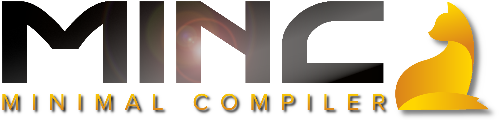

Language compilers and interpreters are complex programs that can take years to develop. With Minc you can create one in a few hours ...

## Just how easy can it be?

Any language created with Minc consists of 4 components: **packages**, **symbols**, **statements** and **expressions**.
A programming language that can run hello world programs can be defined in less than 100 lines of code:

1. Define a package, so that your language can be imported in `minc`:

```C++
MincPackage HELLOWORLD_PKG("helloworld", [](MincBlockExpr* pkgScope) {
	...
});
```

2. Define the language's symbols:

```C++
// Create `string` data type
pkgScope->defineSymbol("string", &META_TYPE, &STRING_TYPE);
```

3. Define the language's expressions:

```C++
// Create expression kernel for interpreting literal expressions
pkgScope->defineExpr("$L",
	[](MincRuntime& runtime, std::vector<MincExpr*>& params) -> bool {
		const std::string& value = ((MincLiteralExpr*)params[0])->value;

		if (value.back() == '"' || value.back() == '\'')
			runtime.result = MincSymbol(&STRING_TYPE, new String(value.substr(1, value.size() - 2)));
		else
			raiseCompileError("Non-string literals not implemented", params[0]);
		return false;
	},
	[](const MincBlockExpr* parentBlock, const std::vector<MincExpr*>& params) -> MincObject* {
		const std::string& value = ((MincLiteralExpr*)params[0])->value;
		if (value.back() == '"' || value.back() == '\'')
			return &STRING_TYPE;
		else
			return nullptr;
	}
);
```

4. Define the language's statements:

```C++
// Create statement kernel for interpreting the `print(...)` statement
pkgScope->defineStmt("print($E<string>)",
	[](MincBlockExpr* parentBlock, std::vector<MincExpr*>& params) {
		params[0]->build(parentBlock);
	},
	[](MincBlockExpr* parentBlock, std::vector<MincExpr*>& params) {
		String* const message = (String*)params[0]->run(parentBlock).value;
		std::cout << *message << '\n';
	}
);
```

Et voilà!

```C++
> import helloworld;
> print("Hello World!");
"Hello World!"
```

You just wrote a programming language!

Note: You may have noticed we didn't declare the "import" statement. Import and export are the only predefined statements in Minc (hence the term: *minimal* compiler).

## Where to go from here

Arbitrarily powerful programming languages can be designed using the same 4 components as our `helloworld` language. Arithmetic expressions, "if" statements, "class" types, ... Just add as many as you like.

The Paws programming language is an excellent reference on how to implement many of the classic programming language constructs, but feel free to be creative!

## High Level Goals

Minc brings significant contributions in the field of modern software architecture. The following high level goals have directed the design of this library.

* Proliferation of programming languages

An ever growing amount of outstanding programming languages have made writing quality code both easier and more complex at the same time. The question about the best language for a specific domain often has no right answer, while wrong answers can incur significant cost to development.

Minc's goal is to eventually support all major programming languages, with transparent wrappers between any two of them built in. This eliminates the need for countless wrapper libraries and answers the unanswerable question: The best programming language is a super-set of all languages. By choosing Minc as the platform for an enterprise scale software system, the architect allows engineers of different teams and backgrounds to collaborate on a shared codebase using each individual's language of choice.

* Abstraction of higher level responsibilities from the core language

Many higher level tasks are traditionally performed by the programming languages itself or by language specific tools. Examples of these tasks are software configuration and version management. Each traditional language introduces separate tool chains and best practices, contributing significantly to the time it takes a programmer to master a new language.

Minc enables the creation of software-agnostic tools that consistently manage the entire software stack.

* Decoupling of software dependencies

Before the advent of the internet, software development was a linear process. Each application started at the design phase, went through some iterations of implementation and testing and eventually ended up being frozen into a final release in the form of a set of floppy disks or a CD. The possibility to update software post-release gave rise to the vicious circle of software maintenance. Today a software that is not under constant development is considered stale and outdated. Even if one were to create a perfect piece of code without any bugs, eventually one of its dependencies will introduce breaking changes with the implementation of a critical security fix or an important new feature. This will force the previously perfect code to be adapted, potentially introducing new bugs and forcing dependent code to propagate the update. With each layer of dependencies, the problem grows exponentially. A program that cannot keep up or whose developers have moved on to other projects will be marked obsolete and replaced by newer tools engineered to relive the same challenges until it will too fall out of the never ending dependency cycle.

The dependency cycle cannot be fully broken, but it's exponential blast radius can. By introducing the ability to transparently mix different programming languages and even different versions of the same language, smaller dependency cycles can be isolated on a per-import basis. It allows using old-and-proven software libraries side-by-side with cutting-edge new packages, preserving the validity of software beyond its retirement date. By shifting development efforts from maintenance. to improvement, Minc has the capability to reshape the present circular redevelopment industry into the goal oriented innovation machinery of the future.

## Features

**TODO**

## Limitations

### Compiling source code

Minc matches source code against statements and expressions and executes associated code kernels. To improve execution performance, most modern languages don't execute such kernels directly, but rather emit an intermediate byte-code or compiled program binary that can then be executed separately. LLVM is a powerful compiler framework used by many languages such as Go and Ruby. The [helloworld-llvm](examples/helloworld/helloworld-llvm/helloworld-llvm.cpp) extends our helloworld example to produce executable program binaries.

**TODO: Write heLLVMoworld using LLVM**

### Selecting a parser

One of the many bold goals of Minc is to be able to compile any programming language in existence, but even an infinite improbability drive requires coordinates [Quote](https://www.imdb.com/title/tt0371724/quotes/qt0351150).

These coordinates are the language grammar. Currently statements and expressions aren't interpreted from raw source code, but from a static abstract syntax tree (AST), generated by a parser ([GNU Bison](https://www.gnu.org/software/bison/)). The difference between Minc's parser and any regular parser for a static language is that Minc's parsers are designed to be as flexible as possible within the boundaries of the underlying language. They can be seen as laying some ground rules for the language. For example: C-flavored languages delimit lines with ";" and surround blocks with "{ ... }", while Python-flavored languages specify blocks with ":" and increased indentation.

At the moment Minc supports two parsers:

* C-Parser
* Python-Parser

The language flavor can only be switched between files. A parser-free resolver that directly matches statements and expressions from source code is one of the stretch goals of Minc. It will allow switching flavors anywhere in code and can truly compile any language (even textual data file formats, like Markdown or XML).

Until that time being restricted by the lean boundaries of the Minc parsers should be seen as more of an advantage than a hindrance. (The more unrestricted your language, the more your users (the programmers) have to scratch their heads before they can efficiently code with it.)

**TODO: Rename parsers "styles" or "flavors"**

## Roadmap

* Free memory

	*All memory leaks will be fixed before the release of Minc 1.0.*

* Add thread-safety

	*At the momemnt Minc is not thread-safe. The release version of Minc will lock individual AST branches during execution.*

* Add continuations

	*The main difficulty in implementing resumable functions is to ensure reentry into suspended statement- and expression kernels does not duplicate state. Continuations may be included in Minc 1.0 or a later release.*

* Develop parser-free resolver

	Static parsers enforce major limitations on to the flexibility of Minc. Replacing it with a parser-free expression resolver is an important step towards unleashing the full potential of Minc. Minc 1.0 will likely still ship with static parsers.