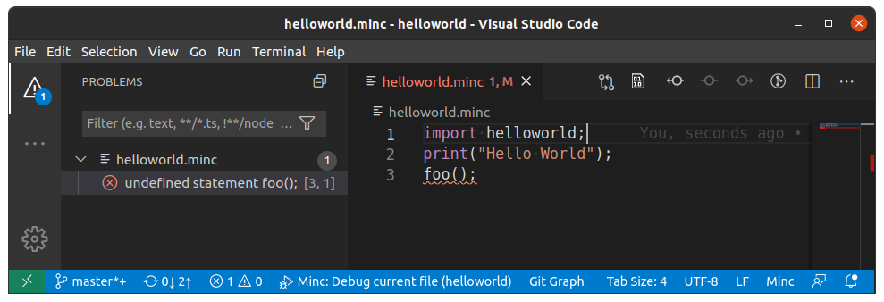
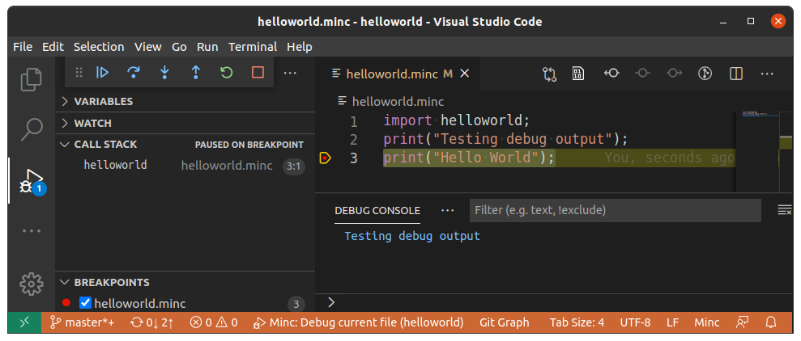

Minc - the Minimal Compiler - is an ultra flexible programming language, that can load other languages by importing them from code.
The main advantages of Minc are:

* Mix any number of compiled or interpreted programming languages within a single file with zero glue code
* Use a single tool chain to manage entire multilingual projects
* Easily create new languages using the Minc API and embed them within existing languages

*Note: Minc is an open source project under active development. If you like the project and would like to accelerate its development, please click the star button, spread the word or [contribute](#Contributing-to-Minc).*


## Multilingual programming

The following example demonstrates tuning a code section written in an interpreted language by embedding a compiled lanaguage.
We implement a recursive fibonacci algorithm in Minc's builtin interpreted language Paws and tune it by gradually replacing parts of the algorithm with compiled C code.

We will first look at the [code](#Code), then describe each [section](#Sections) (a) through (d) and finally evaluate the [runtimes](#Output) of each section in the program output.

### Code

The colors in this code section indicate the programming language each expression will be executed in. Language conversions are handled by implicit type casts.
| Color  | Language                  |
|--------|---------------------------|
| White  | None (builtin statements) |
| Blue   | Paws (interpreted)        |
| Orange | C (compiled)              |


### Sections

* Lines 1-4 import Minc's builtin interpreted language Paws. Each statement is invoked by the Minc interpreter.
* Section (a) calculates fibonnacci number F<sub>30</sub> using a recursive Paws function
* Lines 20 and 21 import the compiled language C. From this point on, C is the host language. Literals such as `30` or `"ms"` are now expressed as C constants and Paws statements are executed from C code by invoking the Minc interpreter.
* Section (b) is identical to section (a), but we already gain some performance, because the if statement, as well as operators `<=` and `-` are executed from C. Note that the `+` operator is still executed in Paws, because both operands are of type `PawsInt`.
* Section (c) reduces the number of implicit type casts by explicitly casting to local C variable `cn`.
* Section (d) replaces the entire Paws function with a C function by changing the return- and argument types of the function from `PawsInt` to `int`. This results in a significant performance boost by saving the cost of copying arguments and growing the stack in the runtime interpreter.

### Output

The program output shows how runtimes gradually decrease between sections (a) and (c) with a significant speedup in section (d).

```
./minc accelerated_fibonacci
Pure Paws fib(30) took 474ms
Paws fib(30) after C import took 416ms
Paws fib(30) with less type casts took 378ms
Pure C fib(30) took 65ms
```

## Add or extend languages with few lines of code

Any language created with Minc consists of 5 components: **packages**, **symbols**, **statements**, **expressions** and **casts**.
A programming language that can run hello world programs can be defined in less than 100 lines of code:

1. Define a package, so that your language can be imported in `minc`:

	```C++
	// Create `helloworld` package
	MincPackage HELLOWORLD_PKG("helloworld", [](MincBlockExpr* pkgScope) {
		...
	});
	```

2. Define the language's symbols:

	```C++
	// Create `string` data type
	MincObject STRING_TYPE, META_TYPE;
	pkgScope->defineSymbol("string", &META_TYPE, &STRING_TYPE);
	```

3. Define the language's expressions:

	```C++
	// Create expression kernel for literal expressions
	// Examples of literals are "foo", 128 or 3.14159
	// For this example we only allow string expressions, like "foo" or 'bar'
	pkgScope->defineExpr(MincBlockExpr::parseCTplt("$L")[0],
		[](MincRuntime& runtime, const std::vector<MincExpr*>& params) -> bool {
			const std::string& value = ((MincLiteralExpr*)params[0])->value;

			if (value.back() == '"' || value.back() == '\'')
				runtime.result = new std::string(value.substr(1, value.size() - 2));
			else
				raiseCompileError("Non-string literals not implemented", params[0]);
			return false;
		},
		[](const MincBlockExpr* parentBlock, const std::vector<MincExpr*>& params) -> MincObject* {
			const std::string& value = ((MincLiteralExpr*)params[0])->value;
			if (value.back() == '"' || value.back() == '\'')
				return &STRING_TYPE;
			else
				return getErrorType();
		}
	);
	```

4. Define the language's statements:

	```C++
	// Create statement kernel for interpreting the `print(...)` statement
	pkgScope->defineStmt(MincBlockExpr::parseCTplt("print($E<string>)"),
		[](MincBuildtime& buildtime, std::vector<MincExpr*>& params) {
			params[0]->build(buildtime);
		},
		[](MincRuntime& runtime, const std::vector<MincExpr*>& params) -> bool {
			if (params[0]->run(runtime))
				return true;
			std::string* const message = (std::string*)runtime.result;
			std::cout << *message << '\n';
			return false;
		}
	);
	```

Et voilà!

```C++
> import helloworld;
> print("Hello World!");
"Hello World!"
```

You just wrote a programming language!

Note: You may have noticed we didn't declare the "import" statement. Import and export are the only predefined statements in Minc (hence the term: *minimal* compiler). To dive deeper into the helloworld language example, consider going though [the extended tutorial](doc/helloworld_explained.md).

## Many languages - One tool chain

Every Minc language supports the complete Minc toolchain, like language-aware syntax highlighting and runtime debugging.

The screenshots below show language server and debug adapter usage with the helloworld language defined above.




---

## Installation

### Build from source

```bash
# Clone source code from GitHub
git clone https://github.com/RcSepp/minc.git
cd minc

# Install dependencies
apt-get install build-essential flex bison libboost-chrono-dev libboost-thread-dev

# Build and install
make
sudo make install

# Check if minc was installed successfully
minc help
```

### Dependencies

* The core Minc framework (`libminc.so`) depends on [GNU Flex](https://www.gnu.org/software/flex/) and [GNU Bison](https://www.gnu.org/software/bison/).
* The package manager (`libminc_pkg.so`) optionally depends on Python and Node.js to load Minc languages defined in Python or node. Note: this feature depends on currently unreleased language bindings for libminc.
* The language server (`libminc_svr.so`) depends on https://github.com/kuafuwang/LspCpp. LspCpp requires https://github.com/Tencent/rapidjson and [boost](https://www.boost.org/).
* The debug adapter (`libminc_dbg.so`) depends on https://github.com/google/cppdap.

Please consider the licensing information in the corresponding [third_party](third_party/) sub-folders when forking or redistributing Minc.

## Documentation

Documentation for many open source projects is scarce. Unfortunatelly Minc is no exception. Please consider the [doc folder](doc/) as a starting point.

## Contributing to Minc

* To report a bug or submit a feature, please open an [issue](https://github.com/RcSepp/minc/issues).

* If you prefer to fix the bug or implement the feature yourself, please create a [pull request](https://github.com/RcSepp/minc/pulls).

* To become an active developer or to publish/promote a new langauge created with Minc (Minc does not have a package repository yet), please send [me](https://github.com/RcSepp) an email.

Any contributions, big or small, are greatly appreciated!

### Developers

* Primary developer: [RcSepp](https://github.com/RcSepp)

* Logo design: [Susan Boltan Design Agency](https://www.fiverr.com/susanboltan)